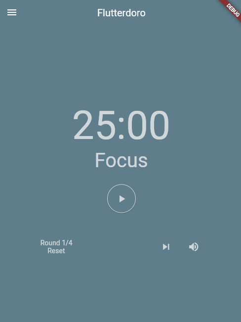
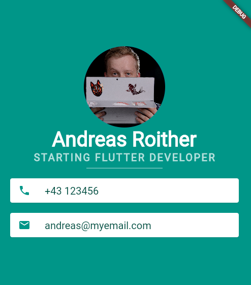

<h1 align="center">
  <!---->
   
  Flutter Projects 

  
</h1>

## Overview

Repository for personal flutter test projects to test out new stuff and learn. The goal is to build different apps while increasing the difficulty or to try out new ideas along the way.

## Apps
### Flutterdoro

A simple pomodoro timer in flutter. Main goal was to recreate the app "[Pomotroid](https://www.electronjs.org/apps/pomotroid)" to increase the difficulty from the last project.

### Personal Business Card App

A starter project for a business card app.

## Technology / Stuff used

[Flutter](https://flutter.dev/)  
[Visual Studio Code](https://code.visualstudio.com/)  
[Android Studio](https://developer.android.com/studio/)  
